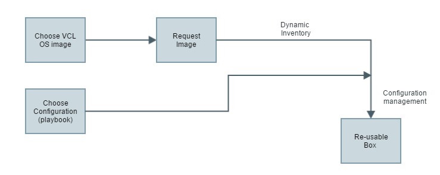
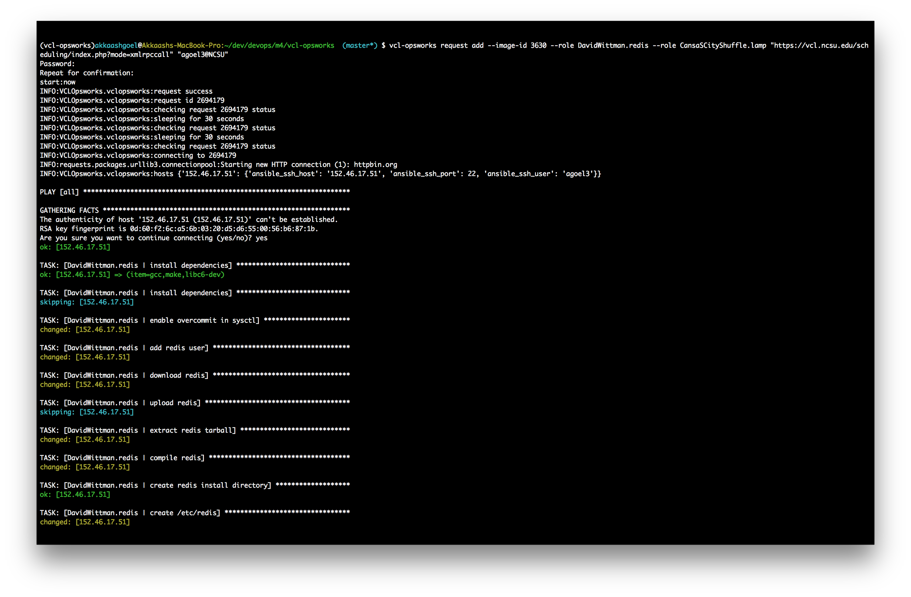
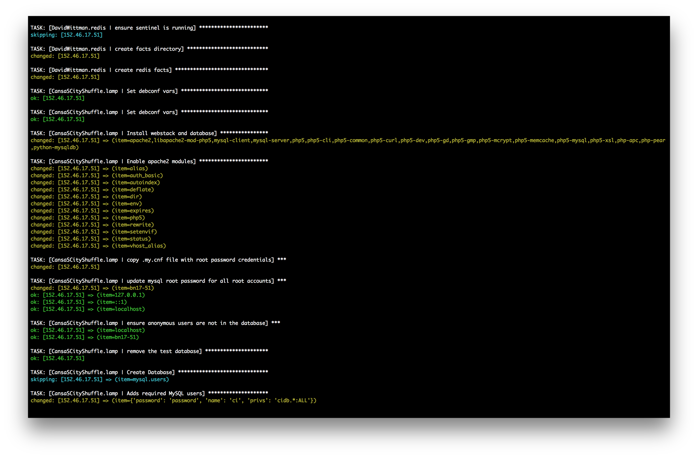
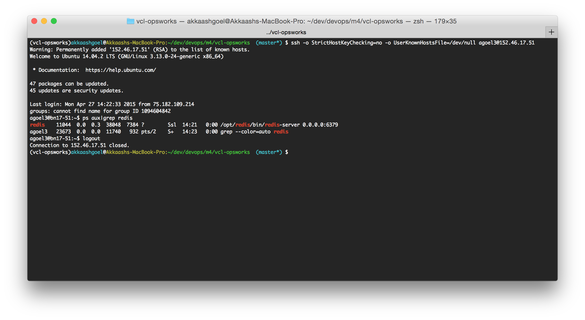
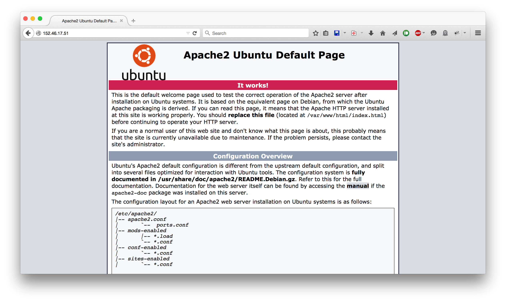

# MILESTONE 4: SPECIAL

__Project Members__
- Anisha Shetty (aashetty)
- Akkaash Goel (agoel3)

Click [here](https://youtu.be/c_qNhMwLo4E) for the screen cast

## Overview

Currently [VCL](http://vcl.apache.org) requires that a user request for an image with an application stack loaded on top of an OS. This requires that different kinds of images to be stored on physical storage. We plan to give the user an option to select from a range of deployment application stacks that can be deployed on a generic OS image. Depending on what the user chooses, configuration management using Ansible can be performed.

This milestone would have two components:

- Dynamic Inventory
- Configuration management

Below is a workflow of the tool.


## Installation & Setup

1. Clone this repository.

2. Install the CLI
    ```console
    $ python setup.py install
    ```

3. Execute this command
    ```console
    $ export ANSIBLE_HOST_KEY_CHECKING=False
    ```

## Usage

```console
$ vcl-opsworks request add --help

Usage: vcl-opsworks request add [OPTIONS] URL USERNAME

Options:
  -i, --image-id INTEGER  image ID to be requested
  -s, --start INTEGER     unix timestamp to start
  -l, --length INTEGER    length of request
  -c, --count INTEGER     no. of requests
  --playbook PATH         playbook path
  --role TEXT             Ansible role for host
  --password TEXT         password for VCL site
  --help                  Show this message and exit.

```
### Examples:
You can specify configuration management either using a playbook or by specifying Ansible roles.

1. To run a playbook `main.yml` on a Ubuntu 14.04 Base box (image id 3630) from NCSU VCL

    ```console
    $  vcl-opsworks request add --image-id 3630 --playbook main.yml "https://vcl.ncsu.edu/scheduling/index.php?mode=xmlrpccall" "username@affiliation"
    ```
You will have to replace username and affiliation specific to your VCL site.

2. To run an Ansible role on on a Ubuntu 14.04 Base box (image id 3630) from NCSU VCL

    ```console
    $ vcl-opsworks request add --image-id 3630 --role DavidWittman.redis "https://vcl.ncsu.edu/scheduling/index.php?mode=xmlrpccall" "username@affiliation"
    ```
You will have to replace username and affiliation specific to your VCL site.

3. To run multiple Ansible roles the command is:
    ```console
    $ vcl-opsworks request add --image-id 3630 --role DavidWittman.redis --role CansaSCityShuffle.lamp "https://vcl.ncsu.edu/scheduling/index.php?mode=xmlrpccall" "username@affiliation"
    ```
Here, the roles specified can be installed using `ansible-galaxy`. More information on that can be found [here](https://galaxy.ansible.com/intro)

## Implementation

#### Dynamic Inventory
We have written a simple wrapper API around [VCL's XMLRPC API](http://vcl.staging.apache.org/docs/xmlrpcWrappers_8php.html). This wrapper API allows us to request VCL images using the `add_request` method. The method accepts an image ID, start of request (UNIX timestamp or "now"), duration of the request and number of requests.

Below is code for `add_request` method.

```python
def add_request(self, image_id, start, length, count=1):
        requests = range(count)
        for i in requests:
            log.debug("adding request: image_id={} start={} length={}".format(image_id,
                      start, length))
            rc = self.client.XMLRPCaddRequest(image_id, start, length)
            yield rc
```

Once the requested images have been successfully reserved, this tool will extract different attributes of the request. It will then create an inventory which will be used for Configuration Management.

Below is code for dynamic inventory creation:

```python
def configure_hosts(self, reservation_obj, playbook):
        inven = Inventory(host_list=reservation_obj.keys())
        for host in inven.get_hosts():
            for key, value in reservation_obj[host.name].items():
                host.set_variable(key, value)
    ...

```

Here `reservation_obj` is a dictionary of like this:

```python
self.hosts[server_ip] = {
                    "ansible_ssh_host": server_ip,
                    "ansible_ssh_user": user,
                    "ansible_ssh_port": connect_port
                }
```

#### Configuration Management

In order to run the playbook, we use the Ansible's python API. Usage for the API can be found [here](http://docs.ansible.com/developing_api.html).

Below is the code that runs the playbook.
```python
def configure_hosts(self, reservation_obj, playbook):
...
    stats = callbacks.AggregateStats()
    playbook_cb = callbacks.PlaybookCallbacks(verbose=utils.VERBOSITY)
    runner_cb = callbacks.PlaybookRunnerCallbacks(stats, verbose=utils.VERBOSITY)
    pb = PlayBook(inventory=inven,
                  playbook=playbook,
                  stats=stats,
                  callbacks=playbook_cb,
                  runner_callbacks=runner_cb)
    pb.run()
```

If the `role` option is speicfied, an on-the-fly playbook is created. The contents of this playbook for example 3 from above is like this:

```yaml
---
- hosts: all
  roles:
  - DavidWittman.redis
  - CansaSCityShuffle.lamp
  sudo: 'yes'
```

The code that generates this playbook is below:

```python
def create_playbook(role):
    stream = open("/tmp/main.yml", "w")
    roles = map(str, list(role))
    d = [{
    "hosts": "all",
    "sudo": "yes",
    "roles": roles
    }]
    yaml.dump(d, explicit_start=True, default_flow_style=False, stream=stream)
    stream.close()
```

## Output

#### CLI output for muliple roles
First role `DavidWittman.redis`. This role installs `redis-server` on the host.


Second role `CansaSCityShuffle.lamp`. This role installs LAMP stack on the host.


We can verify that `redis-server` is running by listing the running processes on the host.


Similarly, the LAMP stack can be verified in the browser.


## Limitations

1. Although, multiple roles are supported, only a single playbook file can be specified at this time.

## Future Work

1. Support for Windows images can be added.

## References and Resources

1. [VCL XMLRPC API](http://vcl.staging.apache.org/docs/xmlrpcWrappers_8php.html)
2. [Ansible Python API](http://docs.ansible.com/developing_api.html)
3. [Ansible Galaxy](https://galaxy.ansible.com/intro)
4. [Click CLI framework](http://click.pocoo.org/4/)
